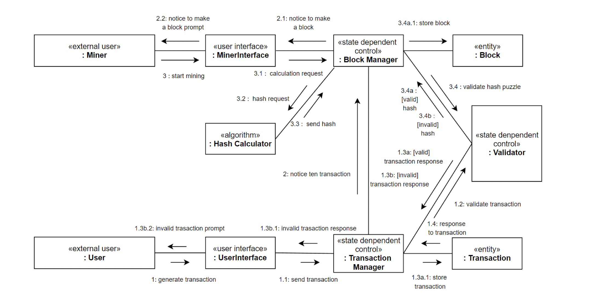

# Demo Block chain

>for CSE4115



* [Description](./Description.md)  
* [Checklist](https://github.com/Joowce/cse4115/issues/6)

## Getting Started

### Prerequisties
```
virtualenv $(venv name)
export PYTHONPATH=./src
```

### installing
```
pip install requirements.txt
```

## run
### Server
```
python ./src/connection/Server.py
```
### User
```
python ./src/interface/UserInterface.py
```
### Miner
```
python ./src/interface/MinerInterface.py
```

